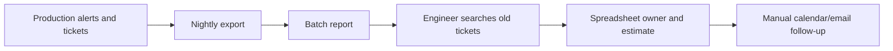
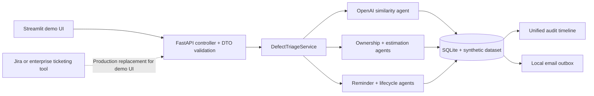

# Architecture

## Before: legacy manual/batch flow

## After: agent-assisted service

The REST controller is stateless; service rules own use cases; SQLite stores demo state.
The API key remains in memory and model responses are requested with `store=false`.
Streamlit accelerates the hackathon demonstration. In production, Jira, ServiceNow, Azure
DevOps, or another ticketing system becomes the primary interface and calls the same REST
contract; Streamlit can be removed or retained as an administrative dashboard.
